# Диаграммы UML для проекта "Цветашки Крым"

## 1. Диаграмма классов (Class Diagram)

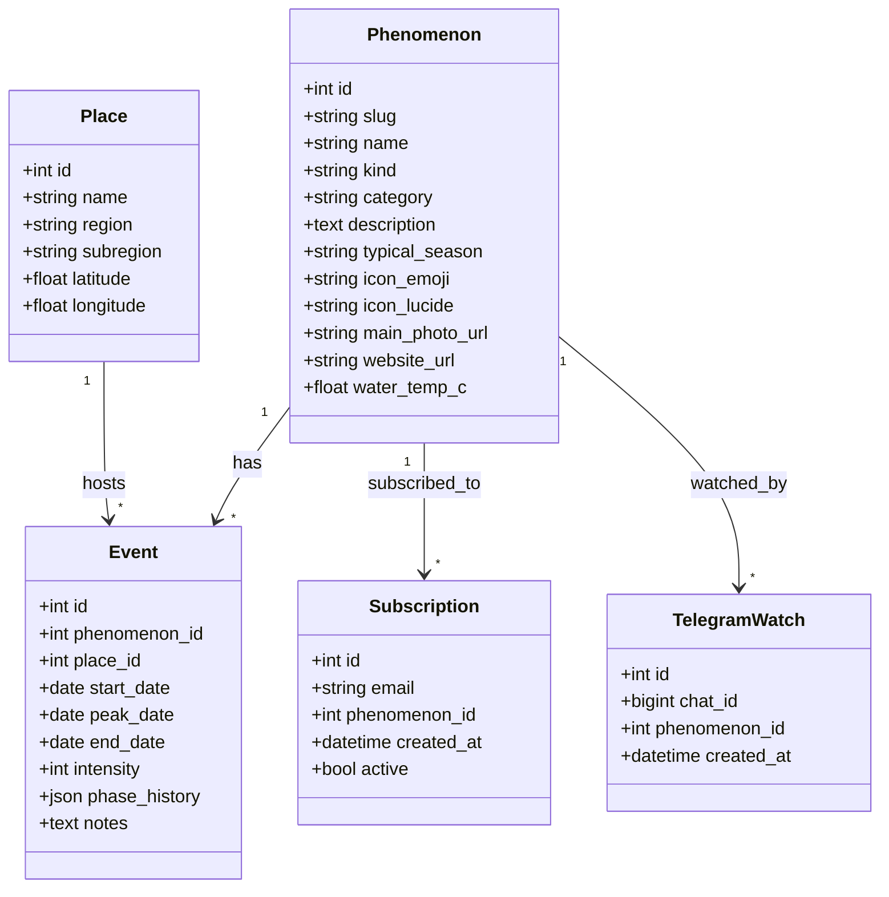

## 2. Диаграмма вариантов использования (Use Case Diagram)

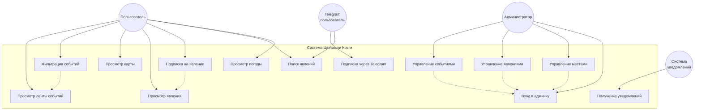

## 3. Диаграммы последовательностей (Sequence Diagrams)

### 3.1. Сценарий: Просмотр ленты событий с фильтрацией

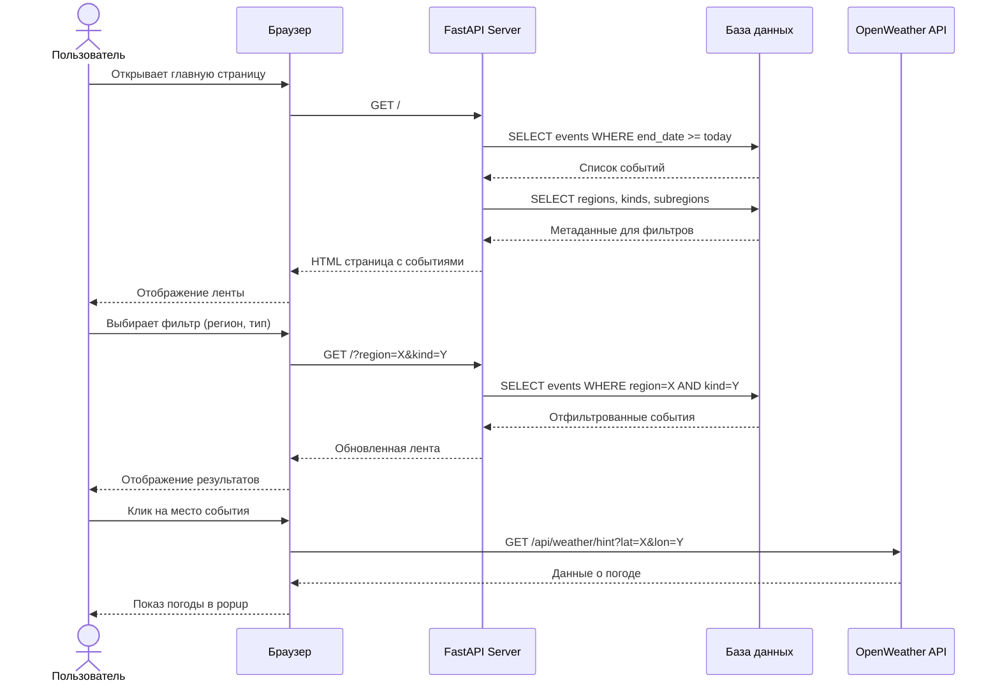

### 3.2. Сценарий: Подписка на явление через сайт

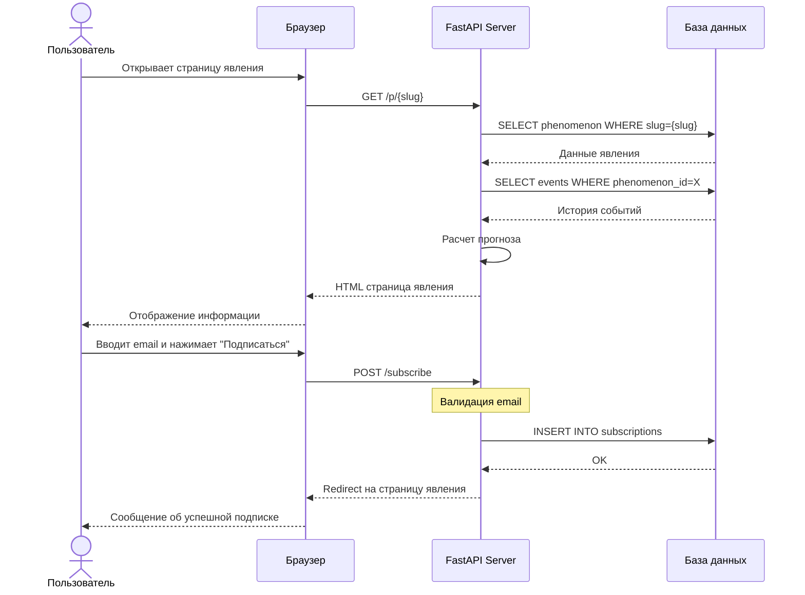

### 3.3. Сценарий: Администрирование - создание события

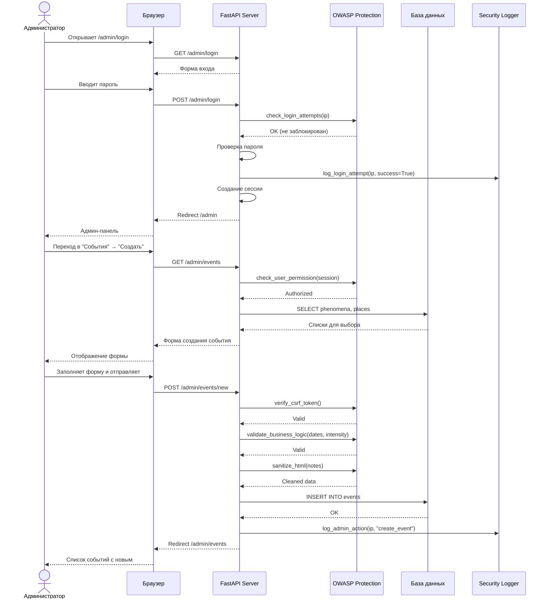

### 3.4. Сценарий: Telegram бот - подписка и уведомления

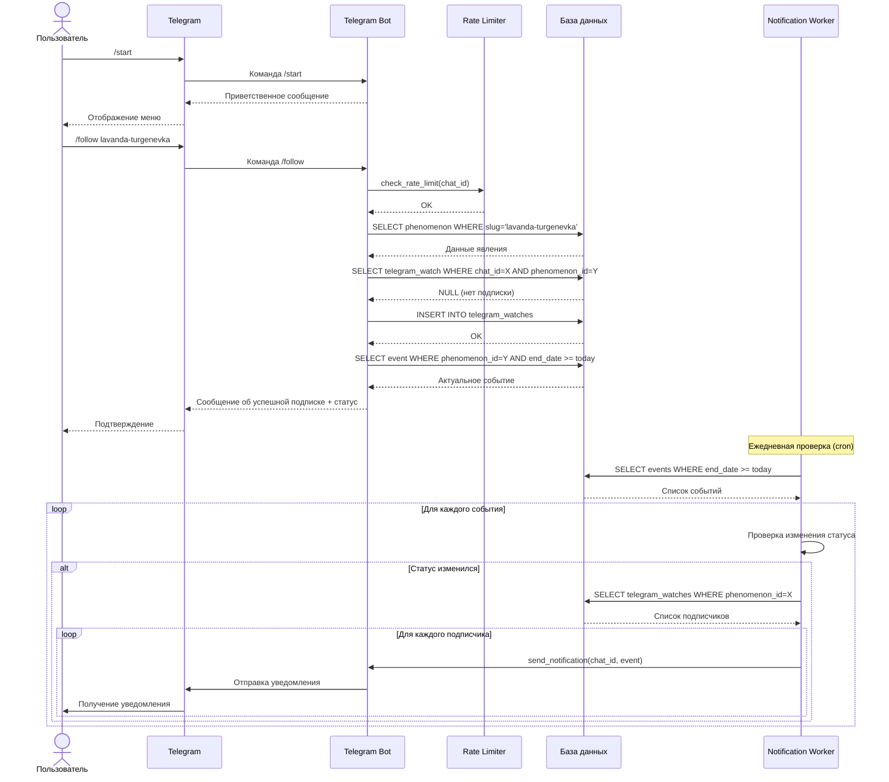

### 3.5. Сценарий: Просмотр карты с событиями

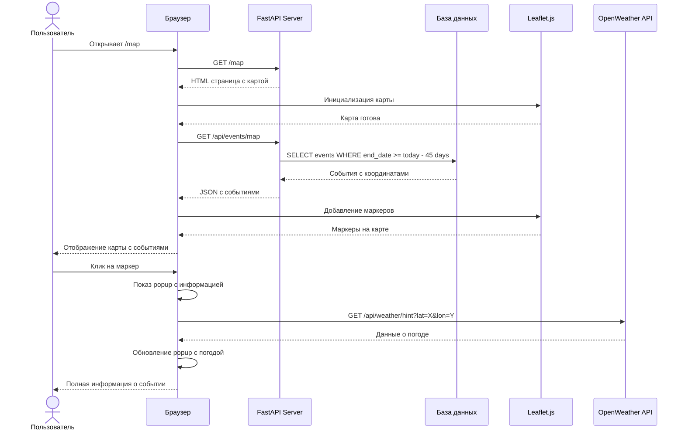

## 4. Диаграммы активностей (Activity Diagrams)

### 4.1. Активность: Просмотр ленты событий

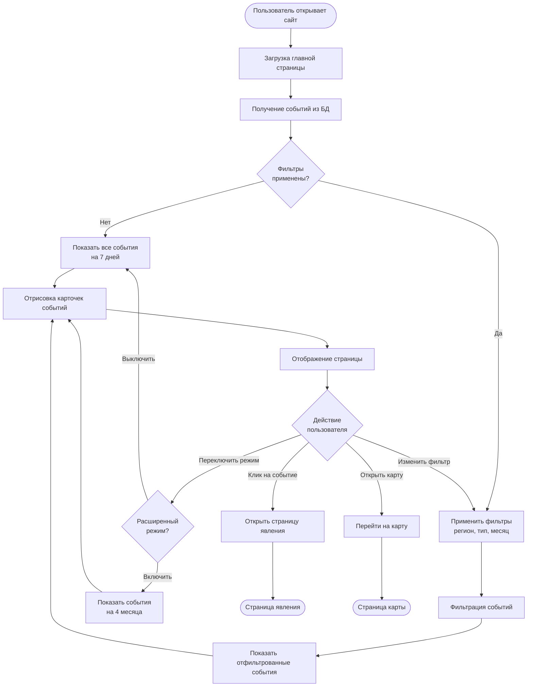

### 4.2. Активность: Подписка на явление

```mermaid
flowchart TD
    Start([Пользователь на странице явления]) --> ViewInfo[Просмотр информации о явлении]
    ViewInfo --> Decision{Хочет<br/>подписаться?}
    
    Decision -->|Нет| End1([Продолжает просмотр])
    Decision -->|Да| EnterEmail[Вводит email в форму]
    
    EnterEmail --> ClickSubscribe[Нажимает "Подписаться"]
    ClickSubscribe --> ValidateEmail{Email<br/>корректный?}
    
    ValidateEmail -->|Нет| ShowError[Показать ошибку]
    ShowError --> EnterEmail
    
    ValidateEmail -->|Да| CheckExisting{Подписка<br/>существует?}
    
    CheckExisting -->|Да| ShowWarning[Показать: уже подписаны]
    ShowWarning --> End2([Остаться на странице])
    
    CheckExisting -->|Нет| SaveSubscription[Сохранить подписку в БД]
    SaveSubscription --> ShowSuccess[Показать успешное сообщение]
    ShowSuccess --> End3([Подписка активна])
```

### 4.3. Активность: Администрирование - создание события

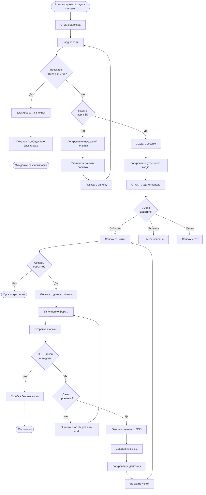

### 4.4. Активность: Telegram бот - подписка

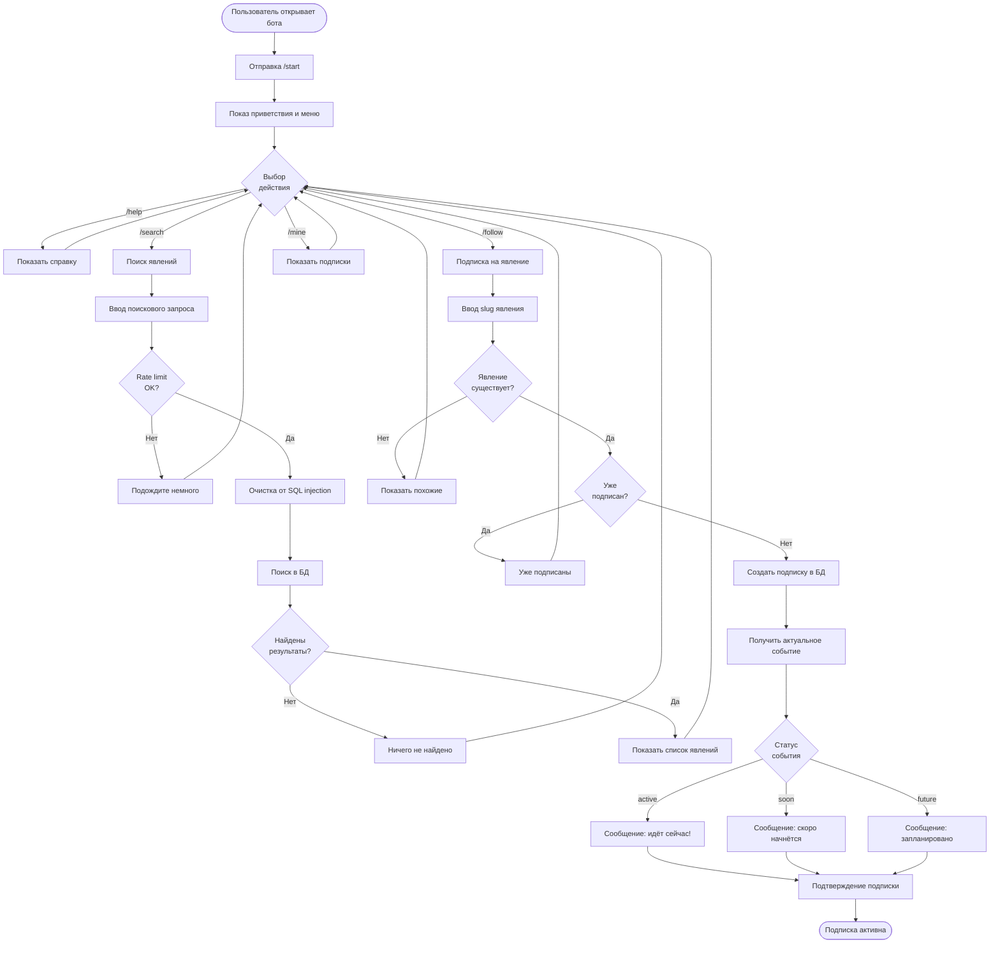

### 4.5. Активность: Система уведомлений

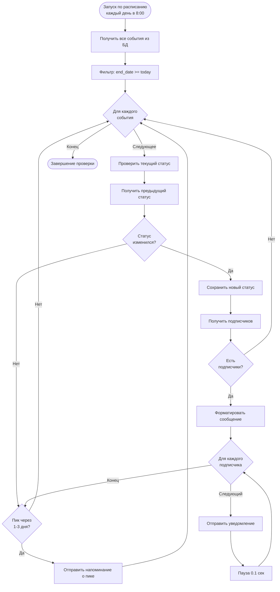

### 4.6. Активность: Просмотр карты

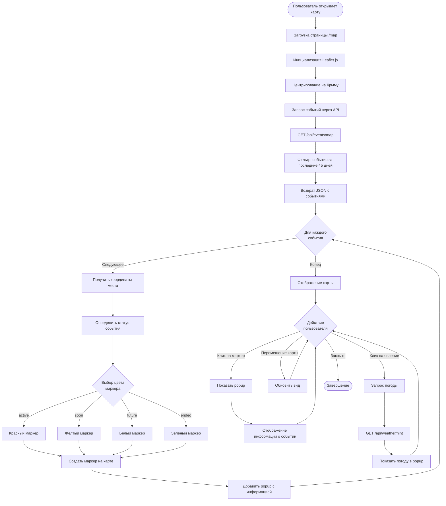

## 5. Диаграмма компонентов (Component Diagram)

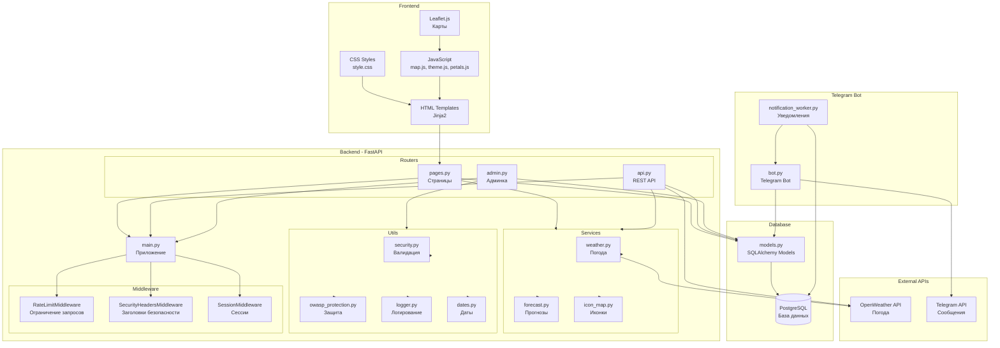

## 6. Диаграмма развертывания (Deployment Diagram)

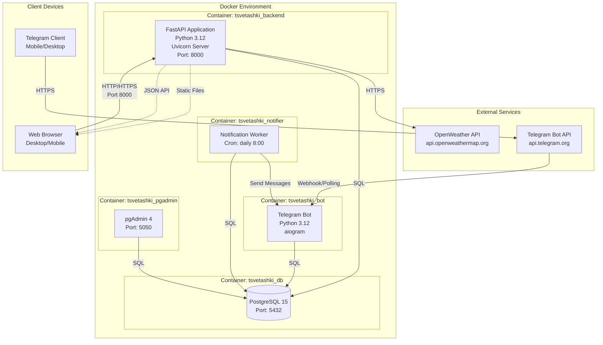

---

## Легенда

### Типы явлений (kind)
- 🌺 **flowering** - Цветение
- 🌅 **visual** - Визуальное явление
- 🍒 **harvest** - Урожай
- 🐬 **animals** - Животные
- 🎪 **activity** - Событие/активность

### Статусы событий
- 🔴 **active** - Идёт прямо сейчас
- 🟡 **soon** - Начинается в ближайшие 7 дней
- ⚪ **future** - Запланировано на будущее
- ✅ **ended** - Завершено

### Роли пользователей
- **Пользователь** - Просмотр событий, подписка через email
- **Администратор** - Управление событиями, явлениями, местами
- **Telegram пользователь** - Подписка и уведомления через бота
- **Система уведомлений** - Автоматическая отправка уведомлений

---

*Документация создана для проекта "Цветашки Крым" - система отслеживания сезонных явлений Крыма*
